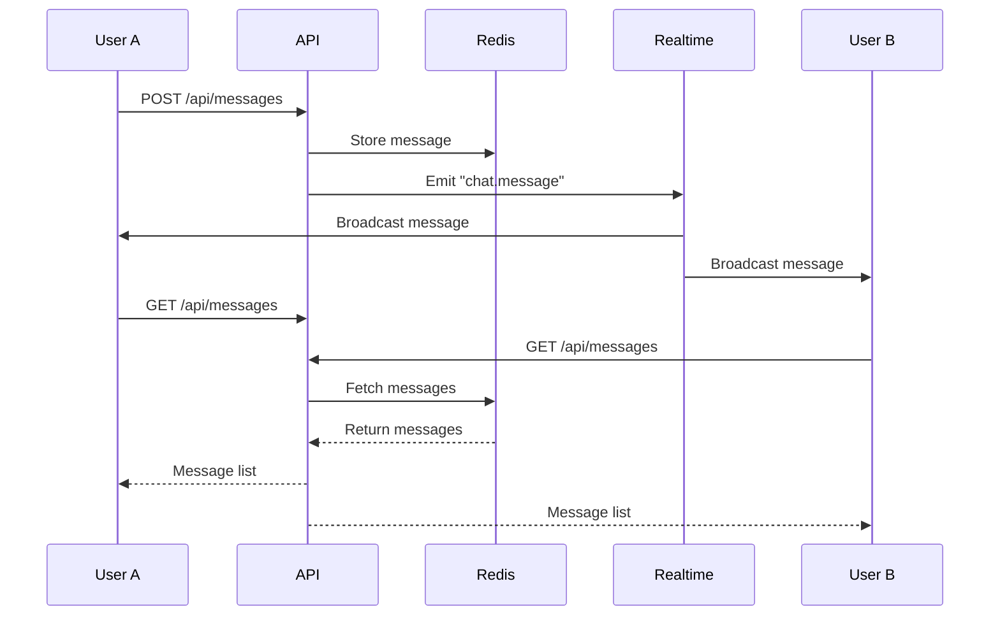

## Core concepts

Private Chat combines three key mechanisms to create truly ephemeral chat rooms:

1. **Time-limited rooms** - Every room expires after exactly 10 minutes
2. **Real-time messaging** - WebSocket-powered instant message delivery
3. **Token-based access** - Secure room access via HTTP-only cookies

## Room lifecycle

<Steps>
  <Step title="Room creation">
    When a user clicks **CREATE ROOM**, the server generates a unique room ID using `nanoid` and stores minimal metadata in Redis:

    ```typescript src/app/api/[[...slugs]]/route.ts:13
    const roomId = nanoid();

    await redis.hset(`meta:${roomId}`, {
      connected: [],
      createdAt: Date.now(),
    });

    await redis.expire(`meta:${roomId}`, ROOM_TTL_SECONDS);
    ```

    The room TTL (Time To Live) is set to **600 seconds (10 minutes)**.
  </Step>

  <Step title="Room access">
    Users access rooms via URL: `/room/[roomId]`

    On first visit, the client receives an authentication token stored as an HTTP-only cookie. This token is added to the room's `connected` array in Redis.

    <Info>
      Authentication tokens are validated on every API request via the `AuthMiddleware` in src/app/api/[[...slugs]]/auth.ts:11
    </Info>
  </Step>

  <Step title="Message exchange">
    Messages are stored temporarily in Redis and broadcast to all connected clients via Upstash Realtime:

    ```typescript src/app/api/[[...slugs]]/route.ts:74
    await redis.rpush(`messages:${roomId}`, {
      ...message,
      token: auth.token,
    });

    await realtime.channel(roomId).emit("chat.message", message);
    ```

    Each message gets the same TTL as the room, ensuring synchronized expiration.
  </Step>

  <Step title="Automatic expiration">
    Redis automatically deletes all room data after 10 minutes:
    - Room metadata (`meta:{roomId}`)
    - Message history (`messages:{roomId}`)
    - Any associated keys

    The client-side countdown timer tracks remaining time:

    ```typescript src/app/room/[roomId]/page.tsx:68
    const interval = setInterval(() => {
      setElapsedSeconds((prev) => {
        const newElapsed = prev + 1;
        if (newElapsed >= initialTtl) {
          clearInterval(interval);
          router.push("/?alert=timer-expired");
        }
        return newElapsed;
      });
    }, 1000);
    ```
  </Step>

  <Step title="Manual destruction">
    Users can destroy rooms early by clicking **DESTROY NOW**:

    ```typescript src/app/api/[[...slugs]]/route.ts:38
    await realtime
      .channel(auth.roomId)
      .emit("chat.destroy", { isDestroyed: true });

    await Promise.all([
      redis.del(auth.roomId),
      redis.del(`meta:${auth.roomId}`),
      redis.del(`messages:${auth.roomId}`),
    ]);
    ```

    All connected clients receive the `chat.destroy` event and redirect to the lobby.
  </Step>
</Steps>

## Real-time messaging architecture

Private Chat uses **Upstash Realtime** for WebSocket communication:

### Server-side setup

Define the event schema with Zod validation:

```typescript src/lib/realtime.ts:5
const schema = {
  chat: {
    message: z.object({
      id: z.string(),
      sender: z.string(),
      text: z.string(),
      roomId: z.string(),
      token: z.string().optional(),
    }),
    destroy: z.object({
      isDestroyed: z.literal(true),
    }),
  },
};

export const realtime = new Realtime({ schema, redis });
```

### Client-side subscription

Clients subscribe to room channels and listen for events:

```typescript src/app/room/[roomId]/page.tsx:107
useRealtime({
  channels: [roomId],
  events: ["chat.message", "chat.destroy"],
  onData: ({ event }) => {
    if (event === "chat.message") {
      refetch(); // Fetch latest messages
    }

    if (event === "chat.destroy") {
      router.push("/?alert=destroyed-true");
    }
  },
});
```

<Tip>
  The `useRealtime` hook automatically handles WebSocket connections, reconnection logic, and event subscriptions.
</Tip>

### Message flow



## Data storage model

All data is stored in Redis with automatic expiration:

### Room metadata

```
Key: meta:{roomId}
Type: Hash
TTL: 600 seconds
Fields:
  - connected: string[] (array of auth tokens)
  - createdAt: number (timestamp)
```

### Message history

```
Key: messages:{roomId}
Type: List
TTL: 600 seconds (synchronized with room)
Values: Message objects
```

### Message structure

```typescript src/types/message.ts:3
export const MessageSchema = z.object({
  id: z.string(),
  sender: z.string(),
  text: z.string(),
  timestamp: z.number(),
  roomId: z.string(),
  token: z.string().optional(),
});
```

<Warning>
  Messages include the sender's auth token but it's only returned to the original sender. Other participants see `token: undefined`.
</Warning>

## Authentication flow

Private Chat uses cookie-based authentication without user accounts:

<Steps>
  <Step title="Generate username">
    When a user first visits, a random username is generated client-side and stored in localStorage:

    ```typescript src/lib/username.ts:1
    export const getUsername = (): string => {
      const username = localStorage.get("custom-username");
      if (!username) {
        throw new Error("Username not found in local storage.");
      }
      return username;
    };
    ```
  </Step>

  <Step title="Token assignment">
    When joining a room, the server issues an auth token stored as an HTTP-only cookie named `x-auth-token`.
  </Step>

  <Step title="Request validation">
    Every API request to room endpoints validates:
    1. Room ID exists in Redis
    2. Auth token exists in cookies
    3. Token is in the room's `connected` array

    ```typescript src/app/api/[[...slugs]]/auth.ts:19
    const roomId = query.roomId;
    const token = cookie["x-auth-token"].value;

    if (!roomId || !token) {
      throw new AuthError("Missing Room ID or Token.");
    }

    const connected = await redis.hget(`meta:${roomId}`, "connected");

    if (!connected?.includes(token)) {
      throw new AuthError("Invalid token");
    }
    ```
  </Step>
</Steps>

<Info>
  Tokens expire when the room is destroyed. No permanent authentication state is maintained.
</Info>

## Self-destruction mechanism

Rooms self-destruct through two paths:

### Automatic expiration (10 minutes)

- Redis TTL expires automatically
- All keys (`meta:*`, `messages:*`) are deleted
- Clients poll `/api/room/ttl` to track remaining time
- When TTL reaches 0, clients redirect to lobby

### Manual destruction

1. User clicks **DESTROY NOW** button
2. API emits `chat.destroy` event via Realtime
3. API deletes all room keys from Redis
4. All connected clients receive event and redirect

```typescript src/app/room/[roomId]/page.tsx:163
<button
  onClick={() => destroyRoom()}
  className="..."
>
  <span className="group-hover:animate-pulse">💣</span>DESTROY NOW
</button>
```

## Scalability considerations

<CardGroup cols={2}>
  <Card title="Serverless-ready" icon="server">
    Built on Next.js with serverless-compatible architecture. No persistent connections on server.
  </Card>
  <Card title="Redis offloading" icon="database">
    Upstash Redis handles data storage and expiration. No application-level cleanup needed.
  </Card>
  <Card title="WebSocket infrastructure" icon="bolt">
    Upstash Realtime manages WebSocket connections. No manual scaling required.
  </Card>
  <Card title="Stateless API" icon="boxes-stacked">
    API routes are completely stateless. Easy horizontal scaling.
  </Card>
</CardGroup>

## Security features

- **HTTP-only cookies** - Auth tokens inaccessible to JavaScript
- **Token validation** - Every request checks room membership
- **No permanent storage** - Data automatically expires
- **Rate limiting** - Message text limited to 1000 characters, sender name to 100
- **Input validation** - Zod schemas validate all API inputs

## Next steps

<CardGroup cols={2}>
  <Card title="Deploy to production" icon="rocket" href="/deployment/vercel">
    Launch your instance on Vercel
  </Card>
  <Card title="API reference" icon="code" href="/api/overview">
    Explore REST endpoints in detail
  </Card>
  <Card title="Redis data model" icon="database" href="/technical/redis-data-model">
    Deep dive into data storage patterns
  </Card>
  <Card title="WebSocket implementation" icon="wifi" href="/technical/websocket-implementation">
    Learn about Upstash Realtime integration
  </Card>
</CardGroup>