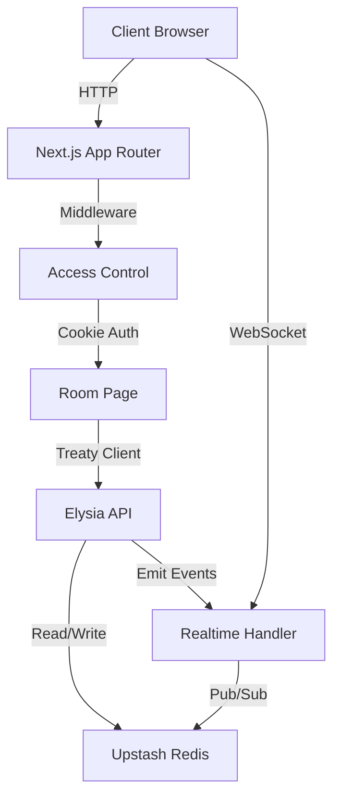

Private Chat is built on a modern, serverless architecture that combines Next.js 16, Elysia, and Upstash services to deliver real-time, ephemeral chat rooms.

## Technology stack

The application leverages the following core technologies:

<Tabs>
  <Tab title="Frontend">
    - **Next.js 16** with App Router for the UI layer
    - **React 19** for component architecture
    - **TanStack Query** for data fetching and caching
    - **@upstash/realtime** client for WebSocket connections
  </Tab>
  <Tab title="Backend">
    - **Elysia** as the backend framework for type-safe API routes
    - **@elysiajs/eden** for end-to-end type safety (Treaty client)
    - **Upstash Redis** for data persistence
    - **@upstash/realtime** server for WebSocket infrastructure
  </Tab>
  <Tab title="Deployment">
    - Next.js middleware for room access control
    - Cookie-based authentication with nanoid tokens
    - Serverless-compatible architecture
  </Tab>
</Tabs>

## System architecture

The application follows a hybrid architecture where Next.js handles routing and rendering, while Elysia manages the API layer.



### Frontend layer

The frontend uses Next.js App Router with client components for interactive features:

```tsx src/app/page.tsx
// Home page creates rooms via Treaty client
const { mutate: createRoom } = useMutation({
  mutationFn: async () => {
    setLoading(true);
    const res = await client.room.create.post();

    if (res.status === 200) {
      router.push(`/room/${res.data?.roomId}`);
    }
  },
});
```

The Treaty client (`@elysiajs/eden`) provides full type inference from backend to frontend:

```ts src/lib/client.ts
import { treaty } from '@elysiajs/eden'
import type { app } from '../app/api/[[...slugs]]/route'

export const client = treaty<typeof app>(
  typeof window === 'undefined' 
    ? 'localhost:3000' 
    : window.location.origin
).api
```

### Backend layer

Elysia runs within Next.js API routes, providing a lightweight, type-safe backend:

```ts src/app/api/[[...slugs]]/route.ts
const rooms = new Elysia({ prefix: "/room" })
  .post("/create", async () => {
    const roomId = nanoid();

    await redis.hset(`meta:${roomId}`, {
      connected: [],
      createdAt: Date.now(),
    });

    await redis.expire(`meta:${roomId}`, ROOM_TTL_SECONDS);

    return { roomId };
  })
```

The backend is structured into two main route groups:

<Accordion title="Room routes">
  - `POST /api/room/create` - Create a new room
  - `GET /api/room/ttl` - Get remaining TTL for a room
  - `DELETE /api/room` - Manually destroy a room
</Accordion>

<Accordion title="Message routes">
  - `POST /api/messages` - Send a message to a room
  - `GET /api/messages` - Fetch message history for a room
</Accordion>

## Request flow

### Creating a room

1. User clicks "Create Room" on the home page
2. Frontend calls `client.room.create.post()`
3. Elysia handler generates a `nanoid()` for the room ID
4. Redis hash `meta:{roomId}` is created with empty connected array
5. TTL of 600 seconds (10 minutes) is set on the meta key
6. Room ID is returned and user is redirected to `/room/{roomId}`

### Joining a room

1. User navigates to `/room/{roomId}` URL
2. Next.js middleware intercepts the request:

```ts src/proxy.ts
const meta = await redis.hgetall<{ connected: string[]; createdAt: number }>(
  `meta:${roomId}`
);

if (!meta) {
  return NextResponse.redirect(
    new URL("/?alert=room-not-found-404", req.url)
  );
}

const existingToken = req.cookies.get("x-auth-token")?.value;

// USER IS ALLOWED TO REJOIN
if (existingToken && meta.connected.includes(existingToken)) {
  return NextResponse.next();
}

// USER IS NOT ALLOWED TO REJOIN
if (meta.connected.length >= 2) {
  return NextResponse.redirect(new URL("/?alert=room-full", req.url));
}
```

3. If the room exists and has space, a token is generated and stored in an HTTP-only cookie
4. Token is added to the `connected` array in Redis
5. User gains access to the room page

### Sending messages

1. User types a message and presses Enter or clicks Send
2. Frontend calls `client.messages.post()` with sender name and text
3. Auth middleware validates the token from cookies:

```ts src/app/api/[[...slugs]]/auth.ts
const connected = await redis.hget<string[]>(`meta:${roomId}`, "connected");

if (!connected?.includes(token)) {
  throw new AuthError("Invalid token");
}
```

4. Message is added to Redis list `messages:{roomId}` using `rpush`
5. Realtime event is emitted to all connected clients:

```ts src/app/api/[[...slugs]]/route.ts
await realtime.channel(roomId).emit("chat.message", message);
```

6. All clients receive the WebSocket event and refetch messages

<Note>
The auth token is included in stored messages but only returned to the message author, enabling the "YOU" label in the UI.
</Note>

## Authentication model

Authentication is cookie-based with randomly generated tokens:

- Tokens are created using `nanoid()` for cryptographic randomness
- Stored in HTTP-only cookies for security
- Cookie settings:
  ```ts
  response.cookies.set("x-auth-token", token, {
    path: "/",
    httpOnly: true,
    secure: process.env.NODE_ENV === "production",
    sameSite: "strict",
  });
  ```
- Tokens are validated on every API request via the `AuthMiddleware`
- Maximum 2 tokens (users) per room

## TTL and expiry management

All room data is ephemeral with automatic expiration:

```ts
const ROOM_TTL_SECONDS = 60 * 10; // 10 minutes
```

- Initial TTL is set when the room is created
- All related keys (`meta:{roomId}`, `messages:{roomId}`) inherit the same TTL
- When new messages are sent, TTL is synchronized:

```ts src/app/api/[[...slugs]]/route.ts
const remaining = await redis.ttl(`meta:${roomId}`);

await redis.expire(`messages:${roomId}`, remaining);
await redis.expire(`history:${roomId}`, remaining);
await redis.expire(roomId, remaining);
```

- Frontend polls TTL every few seconds and displays countdown timer
- When TTL reaches 0, Redis automatically deletes all keys
- Users are redirected when the timer expires

<Info>
Rooms can also be manually destroyed by clicking the "DESTROY NOW" button, which immediately deletes all Redis keys and broadcasts a `chat.destroy` event.
</Info>