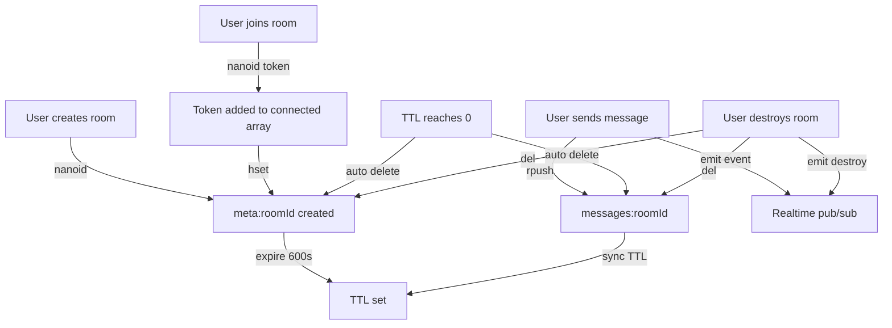

Private Chat uses **Upstash Redis** as its primary data store. All data is ephemeral with automatic expiration, ensuring privacy and preventing data accumulation.

## Redis client configuration

The Redis client is initialized from environment variables:

```ts src/lib/redis.ts
import { Redis } from "@upstash/redis";

export const redis = Redis.fromEnv();
```

This reads `UPSTASH_REDIS_REST_URL` and `UPSTASH_REDIS_REST_TOKEN` from the environment.

## Key structure

Private Chat uses three primary key patterns:

<Tabs>
  <Tab title="meta:{roomId}">
    Stores room metadata including connected users and creation timestamp.
    
    **Type:** Redis Hash
    
    **Example key:** `meta:ABC123xyz`
  </Tab>
  <Tab title="messages:{roomId}">
    Stores the chronological list of messages for a room.
    
    **Type:** Redis List
    
    **Example key:** `messages:ABC123xyz`
  </Tab>
  <Tab title="history:{roomId}">
    Reserved for future use (referenced in TTL sync but not actively used).
    
    **Type:** Unknown
    
    **Example key:** `history:ABC123xyz`
  </Tab>
</Tabs>

## Data structures

### meta:{roomId} (Hash)

Contains room configuration and connection state.

**Schema:**

```ts
{
  connected: string[];  // Array of auth tokens for connected users
  createdAt: number;    // Unix timestamp (milliseconds) when room was created
}
```

**Example:**

```json
{
  "connected": ["abc123def456", "xyz789uvw012"],
  "createdAt": 1709510400000
}
```

**Operations:**

<Accordion title="Creating a room">
  ```ts src/app/api/[[...slugs]]/route.ts
  const roomId = nanoid();

  await redis.hset(`meta:${roomId}`, {
    connected: [],
    createdAt: Date.now(),
  });

  await redis.expire(`meta:${roomId}`, ROOM_TTL_SECONDS);
  ```
  
  Initial `connected` array is empty. Users are added when they join.
</Accordion>

<Accordion title="Adding a user to a room">
  ```ts src/proxy.ts
  const token = nanoid();

  await redis.hset(`meta:${roomId}`, {
    connected: [...meta?.connected, token],
  });
  ```
  
  The token is appended to the `connected` array. Maximum 2 tokens allowed.
</Accordion>

<Accordion title="Checking if a user can join">
  ```ts src/proxy.ts
  const meta = await redis.hgetall<{ connected: string[]; createdAt: number }>(
    `meta:${roomId}`
  );

  if (!meta) {
    return NextResponse.redirect(
      new URL("/?alert=room-not-found-404", req.url)
    );
  }

  if (meta.connected.length >= 2) {
    return NextResponse.redirect(new URL("/?alert=room-full", req.url));
  }
  ```
</Accordion>

<Accordion title="Validating user auth">
  ```ts src/app/api/[[...slugs]]/auth.ts
  const connected = await redis.hget<string[]>(`meta:${roomId}`, "connected");

  if (!connected?.includes(token)) {
    throw new AuthError("Invalid token");
  }
  ```
  
  Used by the auth middleware on every API request.
</Accordion>

### messages:{roomId} (List)

Stores all messages for a room in chronological order.

**Item schema:**

```ts src/types/message.ts
export const MessageSchema = z.object({
  id: z.string(),
  sender: z.string(),
  text: z.string(),
  timestamp: z.number(),
  roomId: z.string(),
  token: z.string().optional(),
});

export type Message = z.infer<typeof MessageSchema>;
```

**Example item:**

```json
{
  "id": "msg_abc123",
  "sender": "Alice",
  "text": "Hello, world!",
  "timestamp": 1709510450000,
  "roomId": "ABC123xyz",
  "token": "abc123def456"
}
```

<Note>
The `token` field is stored with each message to identify the author, but is only returned to the original sender when fetching messages.
</Note>

**Operations:**

<Accordion title="Sending a message">
  ```ts src/app/api/[[...slugs]]/route.ts
  const message: Message = {
    id: nanoid(),
    sender,
    text,
    timestamp: Date.now(),
    roomId,
  };

  // ADD MESSAGES TO HISTORY
  await redis.rpush(`messages:${roomId}`, {
    ...message,
    token: auth.token,
  });

  await realtime.channel(roomId).emit("chat.message", message);

  const remaining = await redis.ttl(`meta:${roomId}`);

  await redis.expire(`messages:${roomId}`, remaining);
  await redis.expire(`history:${roomId}`, remaining);
  await redis.expire(roomId, remaining);
  ```
  
  Messages are appended to the list with `rpush`, then the TTL is synchronized across all keys.
</Accordion>

<Accordion title="Fetching message history">
  ```ts src/app/api/[[...slugs]]/route.ts
  const messages = await redis.lrange<Message>(
    `messages:${auth.roomId}`,
    0,
    -1,
  );

  // ONLY SEND TOKEN IF THE TOKEN MATCHES THE REQUEST TOKEN
  return {
    messages: messages.map((message) => ({
      ...message,
      token: message.token === auth.token ? auth.token : undefined,
    })),
  };
  ```
  
  `lrange(key, 0, -1)` fetches all items in the list from start to end. The token is filtered so users only see their own.
</Accordion>

<Accordion title="Deleting all messages">
  ```ts src/app/api/[[...slugs]]/route.ts
  await realtime
    .channel(auth.roomId)
    .emit("chat.destroy", { isDestroyed: true });

  await Promise.all([
    redis.del(auth.roomId),
    redis.del(`meta:${auth.roomId}`),
    redis.del(`messages:${auth.roomId}`),
  ]);
  ```
  
  Called when a user clicks "DESTROY NOW". All keys are deleted immediately.
</Accordion>

## TTL management

All keys have time-to-live (TTL) configured to ensure automatic cleanup.

### Default TTL

```ts src/app/api/[[...slugs]]/route.ts
const ROOM_TTL_SECONDS = 60 * 10; // 10 minutes
```

Rooms and all associated data expire after 10 minutes of inactivity.

### Setting initial TTL

When a room is created:

```ts
await redis.hset(`meta:${roomId}`, {
  connected: [],
  createdAt: Date.now(),
});

await redis.expire(`meta:${roomId}`, ROOM_TTL_SECONDS);
```

### Synchronizing TTL across keys

When a new message is sent, the TTL is synchronized to prevent keys from expiring at different times:

```ts src/app/api/[[...slugs]]/route.ts
const remaining = await redis.ttl(`meta:${roomId}`);

await redis.expire(`messages:${roomId}`, remaining);
await redis.expire(`history:${roomId}`, remaining);
await redis.expire(roomId, remaining);
```

This ensures:

- All keys for a room expire at the same time
- No orphaned data remains in Redis
- The meta key acts as the source of truth for TTL

### Fetching TTL from the client

The frontend displays a countdown timer based on the TTL:

```ts
const { data: ttlData } = useQuery({
  queryKey: ["ttl", roomId],
  queryFn: async () => {
    const response = await client.room.ttl.get({
      query: { roomId },
    });
    return response.data;
  },
});
```

The API endpoint:

```ts src/app/api/[[...slugs]]/route.ts
.get(
  "/ttl",
  async ({ auth }) => {
    const ttl = await redis.ttl(`meta:${auth.roomId}`);

    return { ttl: ttl > 0 ? ttl : 0 };
  },
  { query: z.object({ roomId: z.string() }) },
)
```

<Info>
`redis.ttl(key)` returns the remaining seconds before expiration. Returns -1 if the key has no TTL, and -2 if the key doesn't exist.
</Info>

### Expiry behavior

When TTL reaches 0:

1. Redis automatically deletes all expired keys
2. Future requests to the room will fail with "room-not-found-404"
3. The middleware redirects users attempting to access the expired room

```ts src/proxy.ts
const meta = await redis.hgetall<{ connected: string[]; createdAt: number }>(
  `meta:${roomId}`
);

if (!meta) {
  return NextResponse.redirect(
    new URL("/?alert=room-not-found-404", req.url)
  );
}
```

## Key cleanup strategies

<Tabs>
  <Tab title="Automatic expiry">
    Redis automatically deletes keys when their TTL expires. This is the primary cleanup mechanism.
    
    ```ts
    await redis.expire(`meta:${roomId}`, ROOM_TTL_SECONDS);
    ```
  </Tab>
  <Tab title="Manual deletion">
    Users can manually destroy rooms using the "DESTROY NOW" button:
    
    ```ts
    await Promise.all([
      redis.del(auth.roomId),
      redis.del(`meta:${auth.roomId}`),
      redis.del(`messages:${auth.roomId}`),
    ]);
    ```
  </Tab>
  <Tab title="Orphan prevention">
    TTL synchronization prevents orphaned keys:
    
    ```ts
    const remaining = await redis.ttl(`meta:${roomId}`);
    await redis.expire(`messages:${roomId}`, remaining);
    ```
  </Tab>
</Tabs>

## Data flow diagram



## Redis commands reference

Here are all Redis commands used in Private Chat:

| Command | Purpose | Example |
|---------|---------|----------|
| `hset` | Set hash field | `redis.hset('meta:roomId', { connected: [] })` |
| `hgetall` | Get all hash fields | `redis.hgetall('meta:roomId')` |
| `hget` | Get single hash field | `redis.hget('meta:roomId', "connected")` |
| `rpush` | Append to list | `redis.rpush('messages:roomId', message)` |
| `lrange` | Get list range | `redis.lrange('messages:roomId', 0, -1)` |
| `expire` | Set TTL | `redis.expire('meta:roomId', 600)` |
| `ttl` | Get remaining TTL | `redis.ttl('meta:roomId')` |
| `exists` | Check if key exists | `redis.exists('meta:roomId')` |
| `del` | Delete key | `redis.del('meta:roomId')` |

<Note>
All commands are executed via the Upstash Redis REST API, making them compatible with serverless environments like Vercel Edge Functions.
</Note>