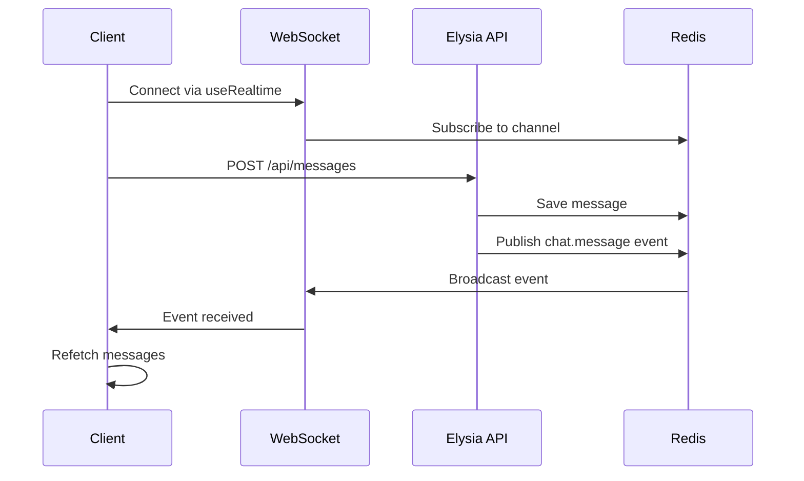

Private Chat uses **@upstash/realtime** for WebSocket-based real-time communication. This library provides a serverless-compatible, Redis-backed pub/sub system with automatic reconnection and type safety.

## Realtime architecture

The Realtime implementation consists of three main components:

1. **Server-side Realtime instance** - Defines event schemas and handles server-to-client broadcasting
2. **WebSocket endpoint** - Exposes a GET handler for WebSocket connections
3. **Client-side useRealtime hook** - Subscribes to channels and receives events



## Server-side configuration

### Realtime instance with schema

The Realtime instance is initialized with a Zod schema that defines all possible events:

```ts src/lib/realtime.ts
import { Realtime, InferRealtimeEvents } from "@upstash/realtime";
import { redis } from "./redis";
import z from "zod";

const schema = {
  chat: {
    message: z.object({
      id: z.string(),
      sender: z.string(),
      text: z.string(),
      roomId: z.string(),
      token: z.string().optional(),
    }),
    destroy: z.object({
      isDestroyed: z.literal(true),
    }),
  },
};

export const realtime = new Realtime({ schema, redis });
export type RealtimeEvents = InferRealtimeEvents<typeof realtime>;
```

<Note>
The schema defines two event types under the `chat` namespace: `message` for new messages and `destroy` for room destruction.
</Note>

### Event schema structure

<Tabs>
  <Tab title="chat.message">
    Fired when a user sends a message to the room.
    
    ```ts
    {
      id: string;        // Unique message ID (nanoid)
      sender: string;    // Username of the sender
      text: string;      // Message content
      roomId: string;    // Room the message belongs to
      token?: string;    // Optional auth token (not sent to other users)
    }
    ```
  </Tab>
  <Tab title="chat.destroy">
    Fired when a room is manually destroyed.
    
    ```ts
    {
      isDestroyed: true; // Always true literal
    }
    ```
  </Tab>
</Tabs>

### WebSocket endpoint

The WebSocket connection is exposed via a Next.js API route:

```ts src/app/api/realtime/route.ts
import { handle } from "@upstash/realtime"
import { realtime } from "@/lib/realtime"

export const GET = handle({ realtime })
```

This creates a WebSocket endpoint at `/api/realtime` that clients connect to. The `handle` function:

- Upgrades HTTP requests to WebSocket connections
- Manages subscriptions to channels
- Handles connection lifecycle (connect, disconnect, reconnect)
- Validates event payloads against the Zod schema

## Client-side implementation

### Creating the useRealtime hook

The client-side hook is generated using the `createRealtime` factory:

```ts src/lib/realtime-client.ts
"use client"

import { createRealtime } from "@upstash/realtime/client"
import type { RealtimeEvents } from "./realtime"

export const { useRealtime } = createRealtime<RealtimeEvents>()
```

This creates a fully typed React hook that:

- Automatically connects to `/api/realtime` WebSocket endpoint
- Infers event types from the server schema
- Provides TypeScript autocomplete for event names and payloads
- Handles reconnection logic automatically

<Info>
The hook must be exported from a `"use client"` file since it uses React hooks and browser APIs.
</Info>

### Using the hook in components

The room page uses `useRealtime` to listen for messages and room destruction:

```tsx src/app/room/[roomId]/page.tsx
import { useRealtime } from "@/lib/realtime-client";

useRealtime({
  channels: [roomId],
  events: ["chat.message", "chat.destroy"],
  onData: ({ event }) => {
    if (event === "chat.message") {
      refetch();
    }

    if (event === "chat.destroy") {
      router.push("/?alert=destroyed-true");
    }
  },
});
```

### Hook parameters

<Accordion title="channels">
  Array of channel names to subscribe to. In Private Chat, each room ID is a channel:
  
  ```ts
  channels: [roomId]
  ```
  
  Multiple channels can be subscribed to simultaneously:
  
  ```ts
  channels: ["room-1", "room-2", "global"]
  ```
</Accordion>

<Accordion title="events">
  Array of event names to listen for. Events follow the `namespace.eventName` pattern:
  
  ```ts
  events: ["chat.message", "chat.destroy"]
  ```
  
  The hook only receives events that match these names on the subscribed channels.
</Accordion>

<Accordion title="onData">
  Callback function invoked when an event is received. Provides the event name and payload:
  
  ```ts
  onData: ({ event, data, channel }) => {
    // event: "chat.message" | "chat.destroy"
    // data: Typed based on the event
    // channel: The channel the event came from
  }
  ```
</Accordion>

## Emitting events from the server

The server emits events using the Realtime instance:

```ts src/app/api/[[...slugs]]/route.ts
// Emit a message event
await realtime.channel(roomId).emit("chat.message", message);

// Emit a destroy event
await realtime
  .channel(auth.roomId)
  .emit("chat.destroy", { isDestroyed: true });
```

The flow for sending a message:

1. Client calls `POST /api/messages` with message data
2. Server validates auth and saves message to Redis
3. Server emits `chat.message` event to the room's channel
4. Upstash Realtime publishes event to Redis pub/sub
5. All connected clients on that channel receive the event
6. Clients trigger `onData` callback and refetch messages

## Type safety

One of the key benefits of this architecture is end-to-end type safety:

```ts
// Server defines schema
const schema = {
  chat: {
    message: z.object({ id: z.string(), sender: z.string(), ... }),
  },
};

// Types are inferred
export type RealtimeEvents = InferRealtimeEvents<typeof realtime>;

// Client hook is fully typed
export const { useRealtime } = createRealtime<RealtimeEvents>();

// TypeScript knows the event types
useRealtime({
  events: ["chat.message"], // Autocomplete works!
  onData: ({ event, data }) => {
    if (event === "chat.message") {
      // data is typed as { id: string, sender: string, ... }
      console.log(data.sender);
    }
  },
});
```

<Note>
If you emit an event that doesn't match the schema, or try to listen for a non-existent event, TypeScript will catch the error at compile time.
</Note>

## Connection lifecycle

The `useRealtime` hook automatically manages the WebSocket connection:

### Initial connection

- When the component mounts, the hook connects to `/api/realtime`
- Subscribes to the specified channels
- Begins receiving events immediately

### Reconnection

- If the connection is lost (network issues, server restart), the hook automatically reconnects
- Subscriptions are restored transparently
- No manual reconnection logic needed

### Cleanup

- When the component unmounts, the hook disconnects from the WebSocket
- Subscriptions are cleaned up server-side
- No memory leaks or dangling connections

## Message delivery guarantees

<Info>
Upstash Realtime uses Redis pub/sub under the hood, which provides at-most-once delivery.
</Info>

This means:

- Messages are not persisted by the pub/sub system itself
- If a client is disconnected when an event is emitted, they won't receive it
- When they reconnect, they must refetch the message history from Redis

In Private Chat, this is handled by:

1. Storing messages in a Redis list (`messages:{roomId}`)
2. Emitting a real-time event to notify connected clients
3. Having clients refetch the full message history on every event

```tsx
useRealtime({
  channels: [roomId],
  events: ["chat.message"],
  onData: ({ event }) => {
    if (event === "chat.message") {
      refetch(); // Refetch from Redis to get the latest state
    }
  },
});
```

This pattern ensures consistency even with network interruptions.